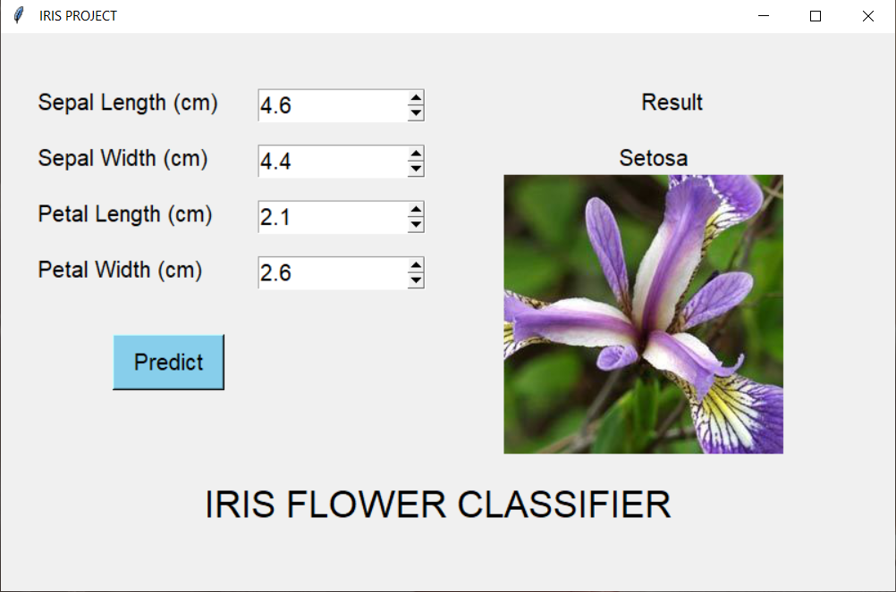
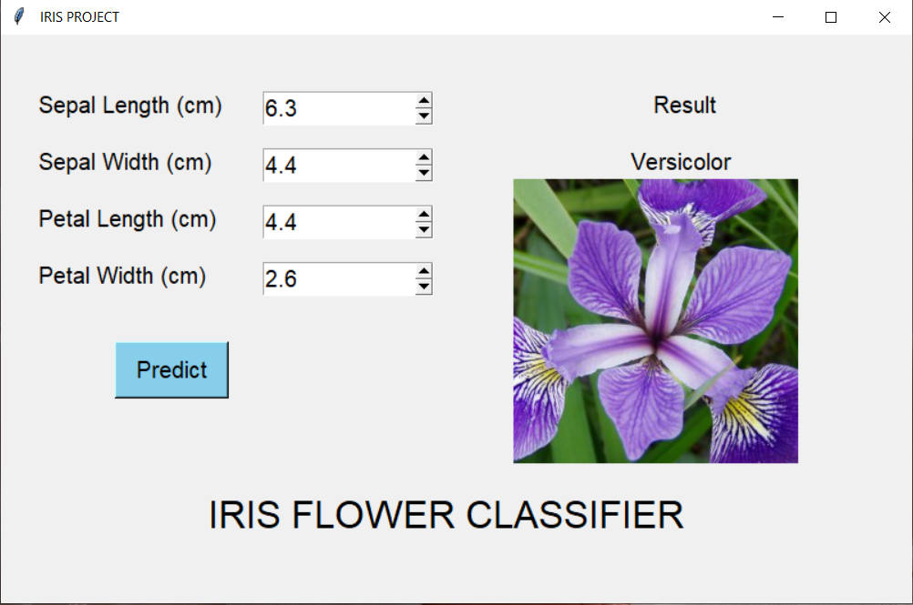

# Iris-Classifier-Project
Uses Machine Learning Python libraries and Predicts the iris flower type based on KNeighboursClassifier model <br>
The aim was to classify iris species into three categories : Setosa, Versicolor and Virginica



Libraries used : sklearn, numpy<br>
Problem Type : Supervised Classification<br>
Training Model : KNeighborsClassifier<br>
Python Version : 3.7



#### Run and deploy
1. Clone and download the repository.
2. Extract the files in a single folder.
3. Run ``` python iris_ui.py ```
